# Python 설치 방법
교육용 로보메이션 로봇 코딩을 위한 python 설치 절차입니다.  
운영체제는 **window11**기준으로 진행하였고, 브라우저는 **Chrome**기준으로 진행하였습니다.

아직 Visual Studio 및 Python 도구를 다운로드 및 설치하지 않은 경우 시작하는 방법은 다음과 같습니다.  
상황에 따라 메뉴얼과 다를 수 있어도 최대한 절차를 빼먹지 않고 따라하시면 됩니다.

### Version 
> 운영체제 : **windows11**  
> 브라우저 : **Chrome**  
> Python : **python-3.9.13**  

  
Python설치가 처음인 경우에는 [**<u>[ Python 설치하는 방법 ]</u>**](##-1.-Python-설치) 을 클릭하세요.

   
### 이 문서의 내용
 - [Python이란?](##-Python이란?)  
 - [Python 설치](##-1.-Python-설치)  
 - [Visual Studio Code 설치](##-2.-Visual-Studio-Code-설치)  
 

   
## Python이란?
파이썬은 초보자가 쉽게 배울 수 있는 프로그래밍언어이기 때문에 파이썬으로 컴퓨터 프로그램을 만드는 방법을 이해하면 다른 프로그래밍 언어로도 쉽게 프로그램을 만들 수 있습니다.  
과거에는 이진 숫자(0과 1)을 입력해서 프로그램을 만들었습니다. 이 이진 숫자로 이루어진 코드를 **이진코드**라고 부릅니다. 하지만 이러한 이진숫자로 프로그램을 만드는 것은 우리 사람에게는 너무 어렵고 비효율적이기 때문에 사람이 이해하기 쉬운 목적으로 만든 것이 바로 **프로그래밍 언어**(programming language)입니다. 그리고 이 프로그래밍 언어로 작성한 프로그램을 **소스코드**(source code)라고 합니다. 

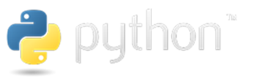
  
그럼 어떤 프로그래밍 언어를 배워야 좋을까? 어떤 프로그래밍 언어가 가장 좋을까? 세상에는 많은 언어가 존재하지만 어떤 언어가 더 좋다는 우위는 없습니다.  
하지만 파이썬은 초보자가 쉽게 배울 수 있는 프로그래밍 언어이기 때문에 파이썬으로 컴퓨터 프로그램을 만드는 방법을 이해하면 프로그래밍 언어로도 쉽게 프로그램을 만들 수 있습니다. 

  
### 파이썬이 인기있는 이유
파이썬은 초보자가 배우기에 쉬운 언어입니다. 그렇다면 그 이유는 무엇일까?

**첫째, 비전공자도 쉽게 배울 수 있는 언어입니다.**

일단 문법이 간단해서 배우기 쉽습니다. C 언어 등의 프로그래밍 언어는 문법이 복잡해서 컴퓨터 공학을 공부하는 학생들도 어렵게 느끼는 경우가 많습니다. 하지만 파이썬은 단순한 문법을 가지고 있어 배우기 쉽습니다.

**둘째, 다양한 분야에서 활용할 수 있습니다.**

많은 사람들이 사용하므로 다양한 분야에서 활용할 수 있습니다. 기본적인 데스크톱 애플리케이션부터 시작해서 웹 서버, 해킹 도구, IoT, 인공지능 등에 모두 활용할 수 있습니다.

**셋째, 대부분의 운영체제에서 동일하게 사용됩니다.**

대부분의 운영체제(OS)에서 같은 방법으로 사용할 수 있습니다. 대부분의 프로그래밍 언어는 운영체제가 제한적입니다. 그리고 여러 운영체제에서 사용할 수 있어도 사용 방법이 조금씩 다른 경우가 있습니다. 하지만 파이썬 프로그래밍 언어는 모든 운영체제에서 같은 방법으로 사용할 수 있습니다.

하지만 단점도 있습니다. 

**느립니다.** 

파이썬 프로그래밍 언어는 일반적으로 C언어보다 10~350배 가량 느립니다. C언어는 어려운 대신 빠릅니다. 그래서 일반적으로 거대한 게임을 만들 때는 C, C++ 등을 이용하여 만들지만 최근에는 컴퓨터 성능이 너무 좋아져서 연산이 많이 필요한 프로그램이 아니라면 프로그래밍 언어의 속도 차이를 크게 느낄 수 업습니다.

   

### 지난 버전인 Python 3.9.13으로 설치하는 이유
추후에 햄스터 AI 카메라를 이용한 인공지능 영상처리 라이브러리인 'roboid ai'설치 중에 'tensorflow'가 python-3.9부터 python-3.11까지만 허용되어있기 때문입니다.

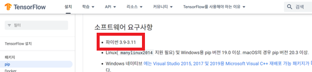

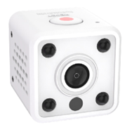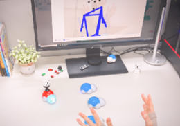

손, 얼굴 등을 인식하여 트래킹하는 기능들이 포함되어 있는 라이브러리인 'mediapipe'도 마찬가지로 python-3.8부터 python-3.11까지 허용되어있습니다.

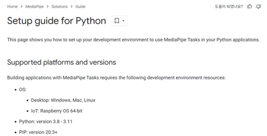

이 버전 외의 Python으로 라이브러리를 설치하면 에러가 발생할 수 있습니다.  
___

### Python-3.9 설치 후 상위 version 설치 시, roboidai, mediapipe 동작유무

클릭하여 펼치기

버전확인 
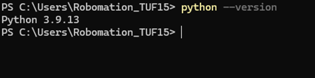  

version-3.12 설치완료후에도 roboidai설치는 원활하지만, mediapipe설치에는 에러가 발생합니다. 
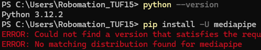   

런 경우에는 python을 version-3.9로 다운그레이드 후에는 mediapipe가 원활히 설치되는 모습을 확인할 수 있습니다. 
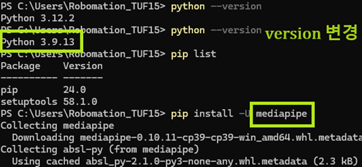   

 

___

  
### 버전에 맞는 python으로 다운그레이드
만약 Python을 설치했지만 python-3.11이상의 버전을 설치한 경우에 로보메이션 제품을 원활히 사용하기 위해서는 상위버전인 python을 Uninstall 후 재설치해야합니다.

#### Uninstall
파일 탐색기로 들어가, 다운로드 목록에서 상위버전 파이썬 설치 실행파일인 'python-3.**'를 찾고 실행시킵니다.

이후 Uninstall을 클릭하면 제거가 완료됩니다.

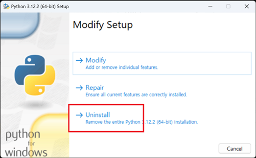

제거가 완료 되었으면 다음 단계로 https://www.python.org/파이썬 홈페이지에 들어가서 [**<u>Python 설치하는 방법</u>**](##-Python-설치)처럼 python-3.9.13을 설치합니다.  

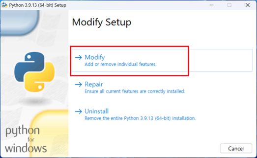  

위 그림과 다른 경우 [**<u>Python 설치하는 방법</u>**](##-1.-Python-설치)로 들어가 메뉴얼을 따라주시면 됩니다.
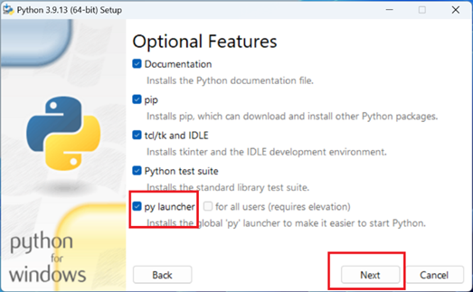  
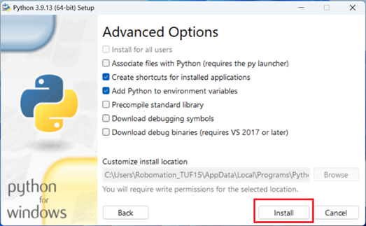    
python-3.9.13이 설치가 완료되었습니다.   
(윈도우) + R 키를 누르고 cmd를 검색하여  커맨드창을 열어 'python --version'을 입력하고 python버전을 확인합니다.
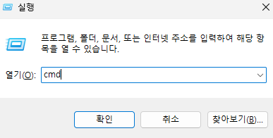
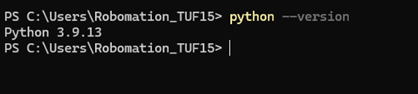   

커맨드 창에 'pip install -upgrade pip'를 입력하여 pip version 또한 업그레이드를 진행시킵니다.

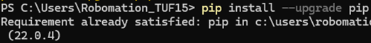

새로운 python 버전 설치가 완료되었으면 컴퓨터를 리부팅(다시시작)시키기를 권장드립니다.

   

## 1. Python 설치
- https://www.python.org/ 에 접속하고 아래 그림과 같이 Downloads 버튼에 마우스 커서를 올리고 Windows 버튼을 클릭합니다.
 
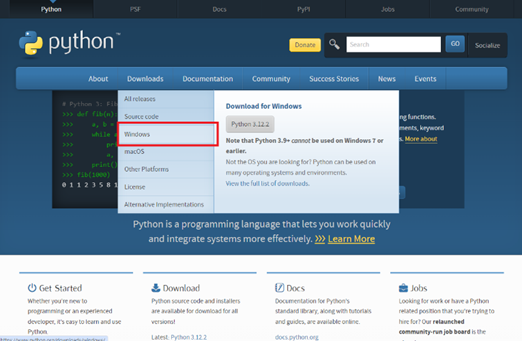
  

- Windows 버튼을 클릭하면 아래 그림과 같은 페이지가 나옵니다. 여기서 키보드로 Ctrl + F 키를 동시에 눌러 우측 상단에 뜬 작은 검색 창에 **python 3.9**를 검색합니다. 
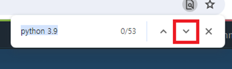
  

- 아래 키를 누르다 보면, 아래 그림과 같이 **'No Files for this release.'**문구가 있는 버전들이 있는데 이 버전들은 download파일이 없으니 더 내려봅니다. 
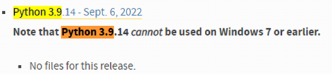
  

- 더 내리다 보면, 아래 그림과 같은 창이 뜨는데 여기서 본인 PC에 맞게 Windows installer를 download하면 됩니다.  

    **[ 본인 PC가 64-bit인지 32-bit인지 확인하는 방법. ]**

  

  
    <u>**
클릭하여 펼치기
**</u>
    
    - 키보드로 (윈도우) + R 키를 누르면 좌측 하단에 창이 뜨는데, 이 창에 'msinfo32'를 입력하고 확인 버튼을 누릅니다.  
    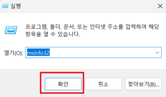
      
    시스템 종류를 확인합니다. 제 PC 기준으로는 ‘x64 기반 PC’ 라고 되어 있으니 64-bit임을 확인했고 ‘x32 기반 PC’라고 되어 있으면 32-bit입니다.  
    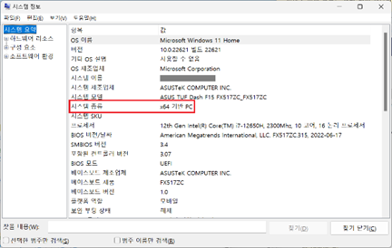
      

  

    
  본인 PC에 맞는 installer를 설치합니다. (제 PC는 64-bit이니, 64비트전용 installer를 설치했습니다.) 

  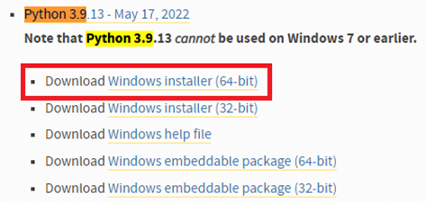
    

- 브라우저 우측 상단에 버튼을 누르고, 설치된 파일을 확인하기 위해 폴더 버튼을 누릅니다.  
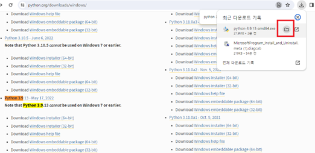
  

- 팝업창에서 새로 설치된‘python-3.9.13-amd64’ 파일을 더블클릭합니다. (사용자 컴퓨터마다 파일명은 다소 다를 수 있습니다.)  
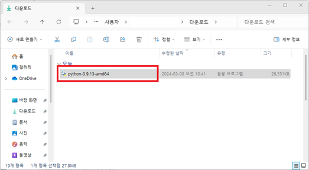
  

- 새로운 팝업창이 뜹니다. 팝업 창 하단에 있는 ‘□ Add Python 3.9 to PATH’ 네모박스에 체크하고, ‘Install Now’를 클릭합니다.  
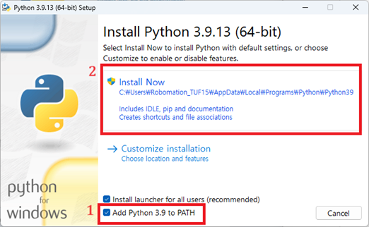
 버튼을 누르게 되면 다음과 같이 설치가 진행됩니다. 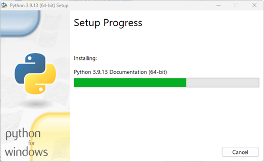
  

- Setup이 완료되면 이 창이 뜨는데 이 때, ‘Disable path length limit’ 버튼을 눌러줍니다.  
  팝업창에 '예'를 누르면 파이썬 설치가 완료됩니다.  

- 파이썬이 성공적으로 설치되었는지 확인해보기 위해, (윈도우) + R 키를 입력하고 cmd를 입력하고 확인 버튼을 누릅니다. 
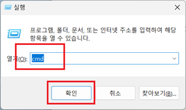   

-	아래 창이 뜹니다. 이를 커맨드창 혹은 터미널이라고 부릅니다.  
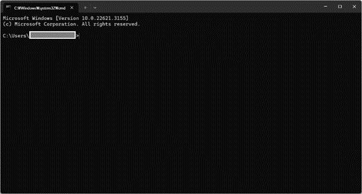   

-	이 창에서 ‘python’ 이라고 입력하 후 Enter를 눌러보면 Python 3.9.13 이라는 문구가 나오고 잘 설치되었음을 확인할 수 있습니다.  

   

## 2. Visual Studio Code 설치
- 이제 python을 사용하기 위한 개발환경으로 Visual Studio Code (VSC)를 설치해보겠습니다.
https://code.visualstudio.com/ 사이트에 들어가, Download for Windows 버튼을 클릭합니다.  
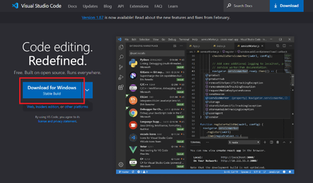
  

- 위의 그림의 Download 버튼을 누르면 우측상단에VSCodeUserSetup 파일이 다운로드 되는 것을 확인할 수 있습니다.
설치가 완료 되었으면 전과 마찬가지로 폴더를 열어 다운로드된 파일을 더블클릭해 설치를 진행합니다.  
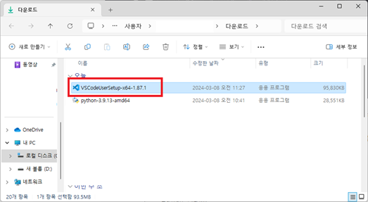
  

- 더블클릭 후 팝업창에서 '동의합니다(A)'를 클릭합니다. 
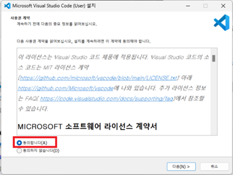
  

-	‘“Code(으)로 열기”작업을 Windows 탐색기 파일의 상황에 맞는 메뉴에 추가’ 버튼을 클릭하고 ‘다음(N) >’ 버튼 클릭합니다.  
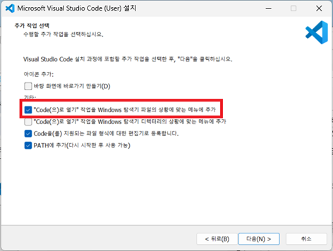 
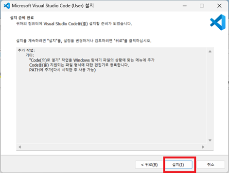 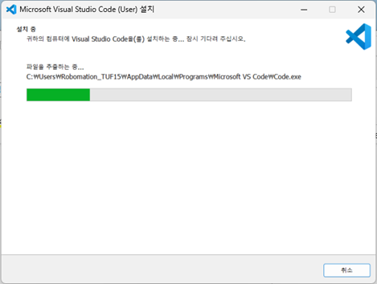 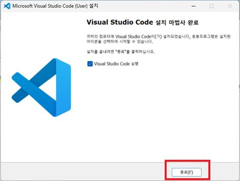
  

-	Visual Studio Code설치가 완료되고 자동으로 실행된 창 좌측에 Extensions을 누릅니다.  
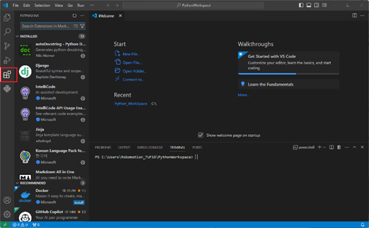
  

-	검색창에 python을 검색하고 Python과 Python Debugger를 설치합니다. 

 설치가 완료되었습니다. 
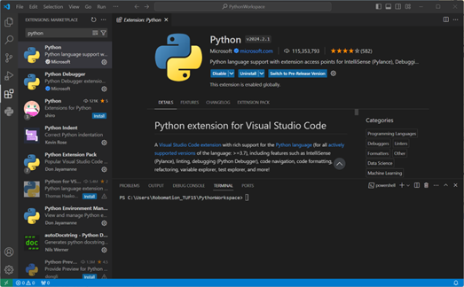
  

   

## 3. VS Code 언어설정 (한국어)
영어가 편하지 않으신분들은 VScode를 한국어로 설정하여 프로그래밍하실 수 있으나, 추후에 발생할 수 있는 몇몇의 문제로 영어 버전으로 진행하시는 것을 권장드립니다.

python까지 설치가 완료되었고 VSC(Visual Studio Code)를 한국어로 설정해보겠습니다.
언어 설정에 대한 안내 팝업이 나타나지 않았거나, 무시하고 지나갔다면 나중에 커맨드 팔레트(상단 검색 바)를 통해서 다시 언어를 설정할 수 있습니다.

- Ctrl + Shift + P로 커맨드팔레트 실행 후 configure display language로 검색해서 선택해줍니다. (검색창을 마우스 커서로 선택했다면, >configure display language 이라고 입력해주어야 합니다.)  
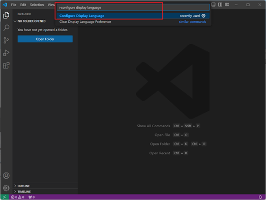
  
ko(한국어)가 있으면 선택해주고. ko가 없다면 아래 그림과 같이 Install Additional Languages...를 선택해줍니다. 
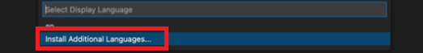  

- 목록에서 한국어를 찾아 Install 버튼을 클릭하여 설치합니다. 
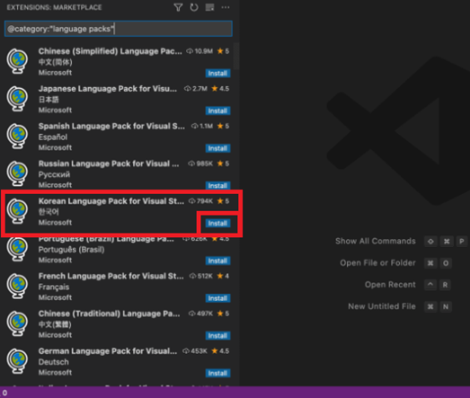   

- 설치가 끝나면 우측 하단에 언어 변경에 대한 팝업이 뜨는데, 설치한 언어(한국어)로 변경하려면 Change Language and Restart 버튼을 클릭합니다. 
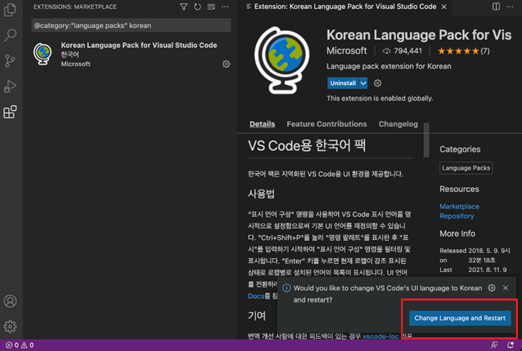  

- 버튼을 클릭하면 자동으로 VS Code가 재실행되고 한국어 언어팩이 적용된 것을 확인할 수 있습니다. 
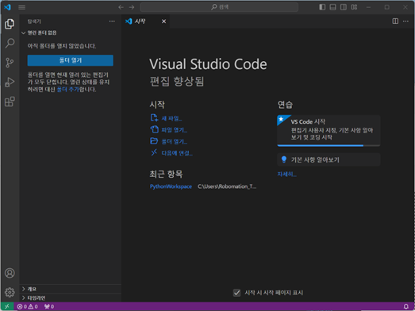  

   

## 4. VS code에서 Python 작업 시작

- 폴더 모양 버튼 클릭 후, 'Open folder' 버튼 클릭 
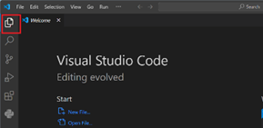  

-	팝업창에서 로컬디스크(C:)클릭 후, 새 폴더 생성 
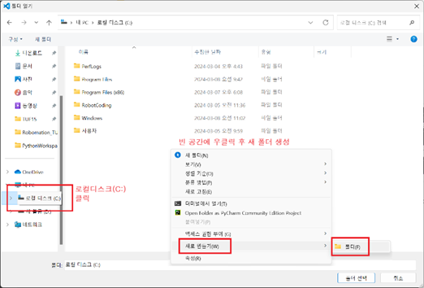  

-	Python 프로젝트를 저장할 폴더를 새로 생성해줍니다.  이름은 알아보기 편하게 ‘Python_WorkSpace’로 하였습니다.
‘폴더 선택’ 클릭 
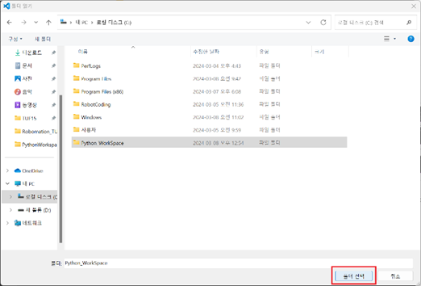  클릭하면 VS code로 넘어갑니다.  

-	이제 새 Python 파일을 만들고 실행시킬 수 있습니다. 그림과 같이 ‘PYTHON_WORKSPACE’를 클릭하고 ‘새 파일...’을 클릭하면 파일명을 기입하는 칸이 나옵니다. 
이 칸에 ‘hello.py’라고 입력합니다. 
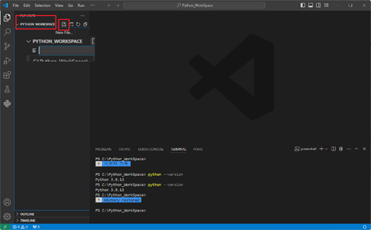  

-	코딩하기에 앞서, 터미널을 열어봅니다. 
Ctrl + Shift + P 를 누르고, terminal이라고 입력하고, 터미널 토글을 찾아서 선택합니다.
( Ctrl+` 로도 터미널 창을 띄울 수 있음) 
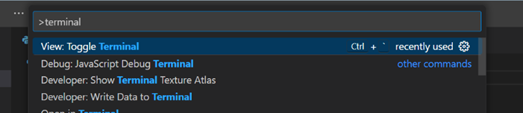   

-	VS Code 창 하단에 터미널 창이 나타났습니다.
이제 hello.py파일에 print(“hello”)라고 입력하고 실행해봅니다. 
    1. hello.py 파일에 print("hello")라고 입력 
   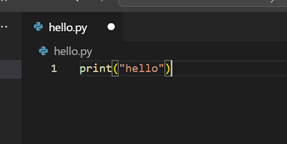 
    2. 저장 ( Ctrl + S )  
    3. 디버깅 ( 'F5' 키 클릭)   첫 디버깅의 경우 다음과 같은 창이 나타납니다. 여기서 python Debugger 클릭. 
    4. Python 파일 선택 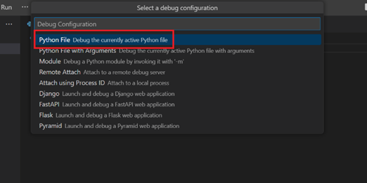
    5. 터미널에서 'hello' 출력 확인 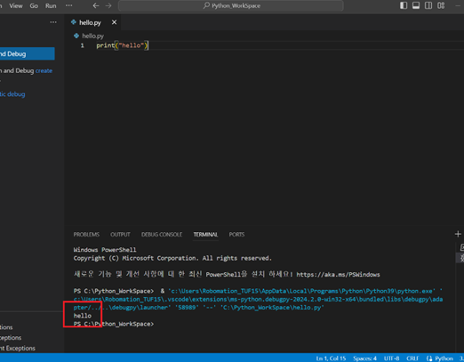
  
- 지금까지 실행했던 파일은 로컬디스크(C:)에 Python_WorkSpace에서 확인하고 관리할 수 있습니다. 
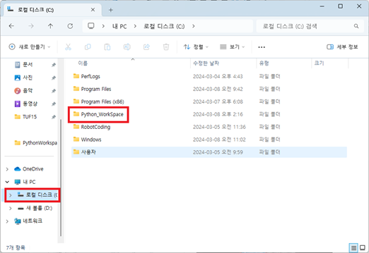   

- hello.py 파일이 생성된 것을 확인할 수 있습니다.  
   

    

# Python 버전확인 및 제거

## Python 버전확인

(윈도우) + R 키를 누르고 cmd를 눌러 커맨드창을 들어갑니다. 

  

커맨드창에 'python --version'을 입력하고 실행(enter)합니다. 
   

아래 출력된 것이 현재 PC에 설치된 Python 버전입니다.  
   

   
## Python 제거방법
### 제어판

파일탐색기()클릭 후 상단 바에 '제어판'검색 
   

새로운 팝업창인 제어판에서 '프로그램 제거' 클릭  
   

우측 상단에 'python'검색  
   

검색된 프로그램을 모두 제거합니다.  
우클릭 → 제거(U)  
   

다음과 같은 팝업창이 뜨면서 삭제합니다.  
   

마찬가지로 Python Launcher도 다음 방법으로 삭제를 진행해줍니다. '예(Y)'버튼 클릭. 
   

   

___

### Python버전 변경 및 삭제 시 완전삭제 방법 (AppData 삭제방법)

클릭하여 펼치기

이 방법은 SSD의 파일을 직접적으로 삭제하는 방법이기 때문에 위의 방법을 따라오고 나서 따라와 주시는 것을 권장드립니다. 
로컬디스크(C:) → 사용자로 들어갑니다. 

   

본인 PC이름으로 되어있는 폴더에 들어갑니다. 
   

... 버튼을 누르고 '옵션'버튼을 누릅니다. 
   

폴더옵션 > 보기 > 숨김파일, 폴더 및 드라이브 표시 체크박스에 체크하면 숨겨진파일인 ‘AppData’가 보입니다. 

   

AppData 폴더를 찾았으면 다음 경로를 따라오면 됩니다. 
C:\Users\Robomation_TUF15\AppData\Local\Programs\Python 
**AppData → Local → Programs → Python** 
   

삭제가 모두 완료되고 새로운 version으로 python을 실행하고자 할 때, PC를 리부팅(다시시작)하시길 권장드립니다.

 

___

